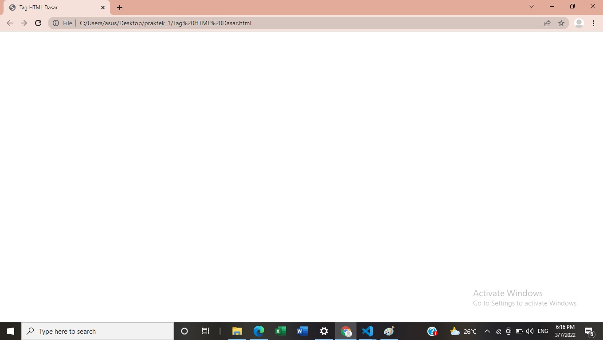
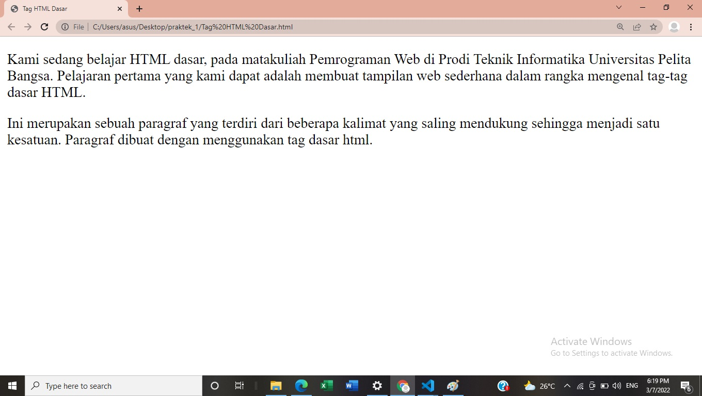
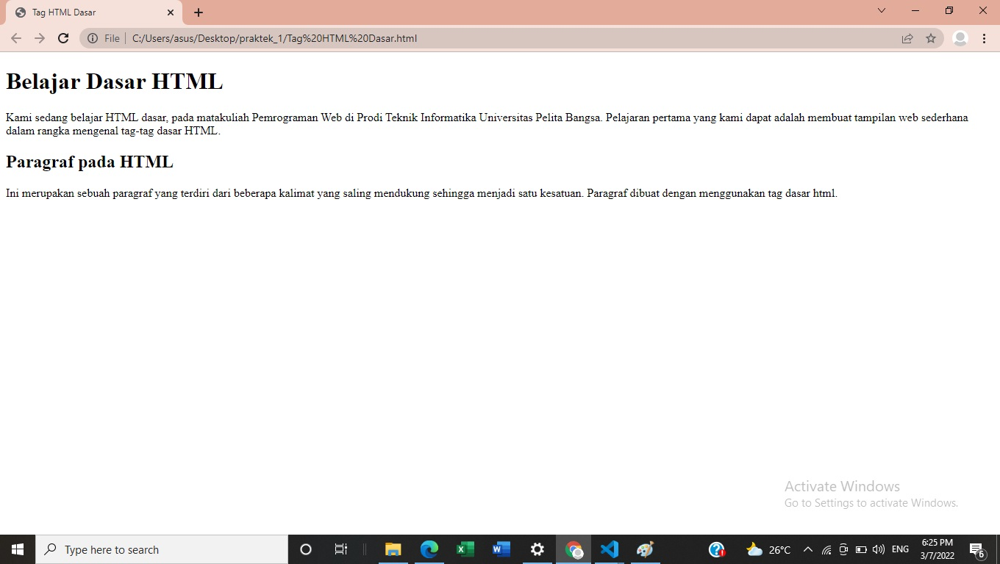
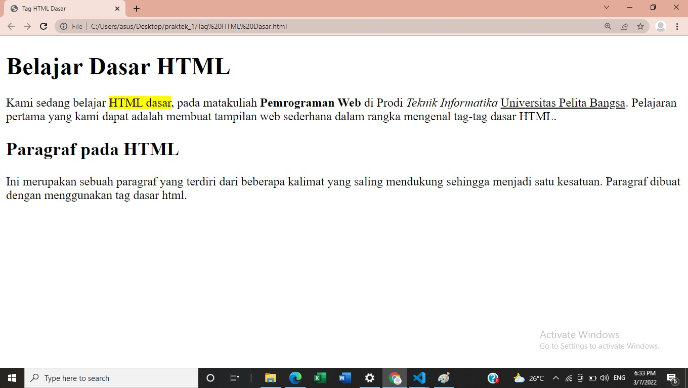
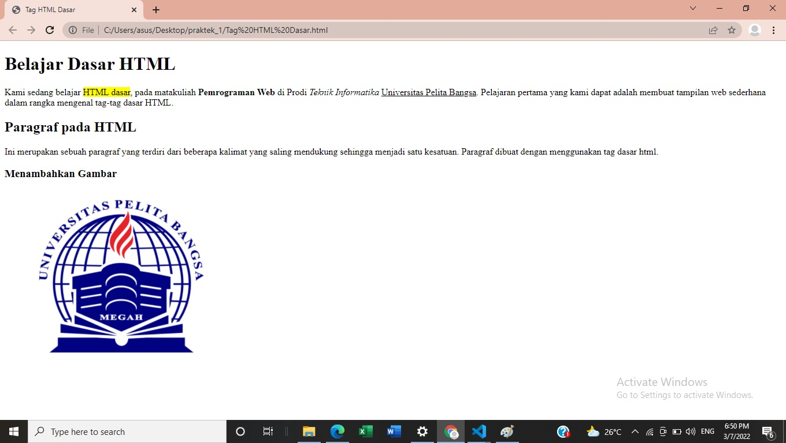
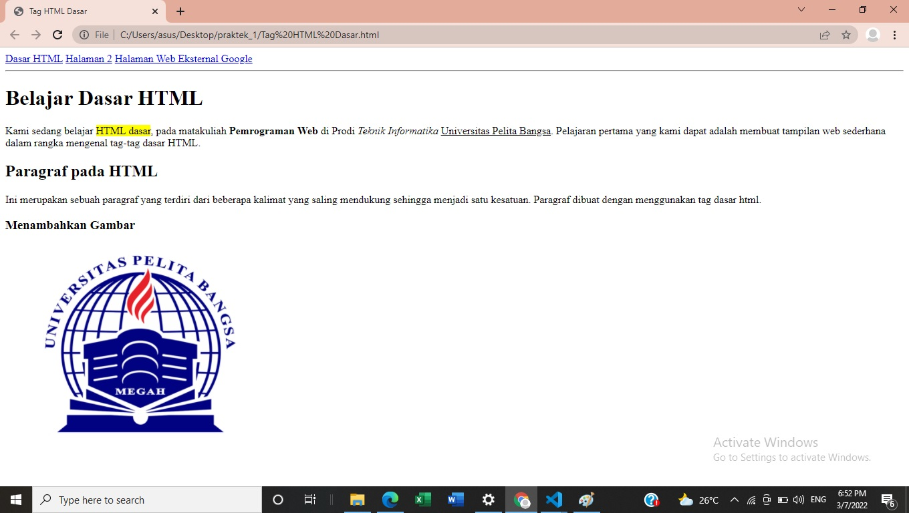

# Lab1Web1
###### Nama : Fara Deviana
###### NIM : 312010407
###### Kelas : TI.A.2

## TugasPertamaWebProgramming

Instruksi Praktikum
1. Persiapkan text editor misalnya VSCode.
2. Buat file baru dengan nama lab1_tag_dasar.html
3. Buat struktur dasar dari dokumen HTML.
4. Ikuti langkah-langkah praktikum yang akan dijelaskan berikutnya.
5. Lakukan validasi dokumen html dengan mengakses http://validator.w3.org

Langkah-langkah Praktikum
Persiapan membuka VSCode dan Browser.

Gambar Tampilan VSCode

Kemudian buat file baru dengan nama lab1_tag_dasar.html dan tambahkan tag dasar dokumen HTML.

## **Modul Praktikum Pemrograman Web**

Gambar Code HTML Dasar

Kemudian selanjutnya, buka file tersebut pada web browser misalnya Mozilla Firefox.

Gambar Web Browser Chrome

1. Membuat Paragraf
Selanjutnya buatlah beberapa paragraf sederhana sebagai berikut

**Gambar Tampilan Paragraf pada Browser

2. Menambahkan Judul

**Gambar Tampilan Heading 1 dan Heading 2

3. Memformat teks
Lakukan pemformatan teks yang ada pada paragraf yang sudah ada sebelumnya, mengacu kepada 
penjelasan materi pemformatan teks, sehingga tampilannya seperti berikut.

**Gambar Pemformatan Teks

Lakukan eksperimen lainnya dengan tag-tag pemformatan teks yang ada.

4. Menyisipkan Gambar
Untuk menyisipkan gmbar, siapkan gambar yang akan disisipkan pada halaman web, kemudian 
simpan file gambar tersebut satu folder dengan file dokumen html. Atau bisa juga menyisipkan 
gambar dari website external

**Gambar Menampilkan Gambar.

5. Menambahkan Hyperlink

**Gambar Tampilan Hyperlink

