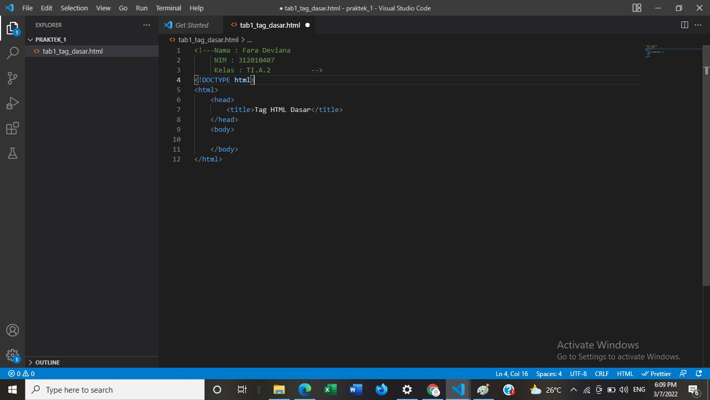

# Lab1Web1
##Nama : Fara Deviana
NIM : 312010407
Kelas : TI.A.2##

TugasPertamaWebProgramming

Instruksi Praktikum
1. Persiapkan text editor misalnya VSCode.
2. Buat file baru dengan nama lab1_tag_dasar.html
3. Buat struktur dasar dari dokumen HTML.
4. Ikuti langkah-langkah praktikum yang akan dijelaskan berikutnya.
5. Lakukan validasi dokumen html dengan mengakses http://validator.w3.org

Langkah-langkah Praktikum
Persiapan membuka VSCode dan Browser.

Gambar Tampilan VSCode

Kemudian buat file baru dengan nama lab1_tag_dasar.html dan tambahkan tag dasar dokumen HTML.

##**Modul Praktikum Pemrograman Web**##

